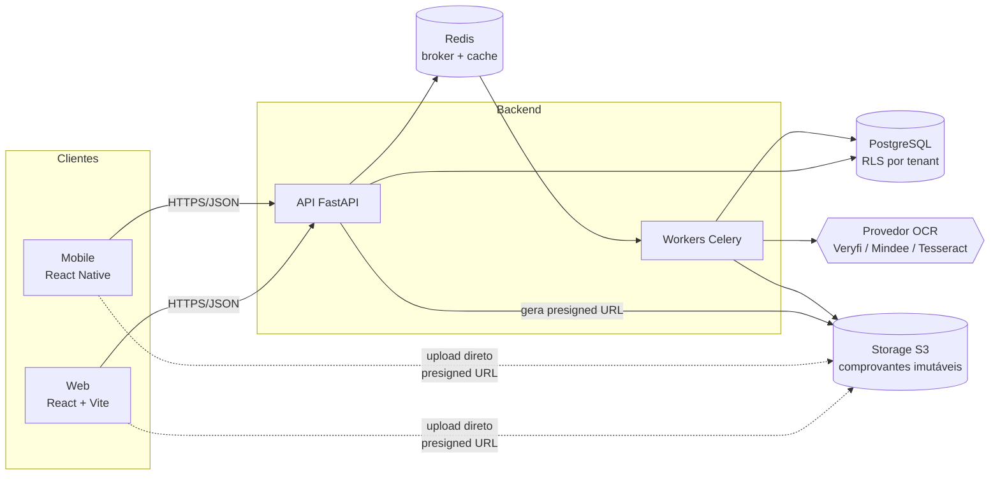

# Sistema de Lançamento e Prestação de Contas

> Captura de comprovantes (boletos, recibos, notas fiscais) por scanner/câmera ou upload, extração automática via OCR, organização por faixa de valor e vencimento, controle de pagamento de boletos e geração de relatórios de prestação de contas — multiempresa, com isolamento por tenant.

**Status:** Sprints [00](docs/sprints/sprint-00.md) (fundação) e [01](docs/sprints/sprint-01.md) (login e multiempresa) implementadas

---

## Sumário

- [Visão geral](#visão-geral)
- [Funcionalidades do MVP](#funcionalidades-do-mvp)
- [Stack tecnológica](#stack-tecnológica)
- [Arquitetura](#arquitetura)
- [Estrutura do repositório](#estrutura-do-repositório)
- [Como rodar localmente](#como-rodar-localmente)
- [Roadmap e sprints](#roadmap-e-sprints)
- [Documentação](#documentação)
- [Convenções](#convenções)

---

## Visão geral

O usuário fotografa ou envia até **10 comprovantes por vez** (PDF multi-página, JPG, PNG). Cada arquivo é validado, armazenado de forma imutável e processado de forma **assíncrona** por um provedor de OCR, que extrai fornecedor (nome fantasia), CNPJ, datas, valor e itens — cada campo com **score de confiança**. Campos abaixo de 80% exigem revisão manual.

Após a revisão, o lançamento é classificado automaticamente por **faixa de valor** (configurável por empresa), ordenado por **vencimento** e fica disponível para:

- **Pagamento de boleto** — "Paguei hoje" ou "Selecionar outro dia", com histórico append-only;
- **Aprovação** — colaborador → aprovador, com segundo nível para faixas altas;
- **Prestação de contas** — relatórios por período/projeto/centro de custo, exportados em PDF/Excel com os comprovantes anexados;
- **Exportação para planilha** — qualquer tabela do sistema (lançamentos, boletos, fornecedores, pagamentos, aprovações) pode ser baixada em Excel ou CSV com os filtros da tela.

O documento de origem com todo o levantamento está em [`plano_completo_projeto_prestacao_contas.md`](plano_completo_projeto_prestacao_contas.md).

## Funcionalidades do MVP

| Código | Funcionalidade | Sprint |
|--------|----------------|--------|
| RF01 | Captura via câmera ou upload (até 10 docs simultâneos) | [03](docs/sprints/sprint-03.md), [10](docs/sprints/sprint-10.md) |
| RF02 | Extração automática via OCR (fornecedor, CNPJ, datas, valor, itens) | [04](docs/sprints/sprint-04.md), [05](docs/sprints/sprint-05.md) |
| RF03 | Classificação por faixa de valor e ordenação por vencimento | [06](docs/sprints/sprint-06.md) |
| RF04 | Edição manual dos campos extraídos | [05](docs/sprints/sprint-05.md) |
| RF05 | Vínculo de lançamentos a relatórios de prestação de contas | [09](docs/sprints/sprint-09.md) |
| RF06 | Fluxo de aprovação (colaborador → aprovador) | [08](docs/sprints/sprint-08.md) |
| RF07 | Exportação PDF/Excel com comprovantes | [09](docs/sprints/sprint-09.md) |
| RF08 | Dashboard por fornecedor, faixa e status | [06](docs/sprints/sprint-06.md) |
| RF09 | Pagamento de boleto (hoje / reagendar) | [07](docs/sprints/sprint-07.md) |
| RF10 | Multiempresa com isolamento por tenant | [01](docs/sprints/sprint-01.md) |
| RF11 | Upload de PDF multi-página e imagens | [03](docs/sprints/sprint-03.md) |
| RF12 | Exportação das tabelas do sistema para planilha (XLSX/CSV) | [07](docs/sprints/sprint-07.md), [08](docs/sprints/sprint-08.md), [09](docs/sprints/sprint-09.md) |

A matriz completa (incluindo requisitos não funcionais) está em [`docs/sprints/README.md`](docs/sprints/README.md#matriz-de-rastreabilidade).

## Stack tecnológica

| Camada | Tecnologia |
|--------|------------|
| Backend / API | Python 3.12, FastAPI, Pydantic v2, SQLAlchemy 2.0 (async), Alembic |
| Banco de dados | PostgreSQL 16 — Row Level Security, JSONB, `pg_trgm`, `btree_gist` |
| Processamento assíncrono | Celery + Redis |
| Armazenamento de arquivos | S3-compatible (RustFS em dev, AWS S3 em produção) via presigned URLs |
| OCR | Adapter `OcrProvider`: Tesseract/PaddleOCR (dev) · Veryfi / Mindee / Taggun (produção) |
| Frontend web | React 18, TypeScript, Vite, TanStack Query, React Router, React Hook Form + Zod |
| Mobile | React Native (Expo, dev build) + ML Kit Document Scanner |
| Autenticação | JWT (access) + refresh token rotativo, RBAC (`admin`, `aprovador`, `colaborador`) |
| Validação de arquivos | `python-magic` (magic bytes) + `pypdf` / `Pillow` (parsing real) |
| Relatórios e planilhas | WeasyPrint (PDF) + openpyxl (XLSX em modo streaming) + CSV |
| Qualidade | Ruff, mypy, pytest, ESLint, Prettier, Vitest, Playwright, GitHub Actions |
| Observabilidade | Logs estruturados (structlog), Prometheus, Sentry |

Decisões arquiteturais estão registradas em [`docs/adr/`](docs/adr/).

## Arquitetura



Detalhes de componentes, fluxos e sequências: [`docs/arquitetura.md`](docs/arquitetura.md).

## Estrutura do repositório

Estrutura do monorepo (pastas vazias são preenchidas nas próximas sprints):

```
.
├── backend/
│   ├── app/
│   │   ├── api/            # routers FastAPI (v1)
│   │   ├── core/           # config, segurança, logging
│   │   ├── db/             # sessão, contexto de tenant (RLS)
│   │   ├── domain/         # regras de negócio (faixas, status, pagamento)
│   │   ├── models/         # SQLAlchemy
│   │   ├── schemas/        # Pydantic
│   │   ├── services/       # storage, OCR, relatórios
│   │   └── workers/        # tasks Celery
│   ├── migrations/         # Alembic
│   └── tests/
├── web/                    # React + TypeScript + Vite
├── mobile/                 # React Native (Expo)
├── infra/
│   ├── docker-compose.yml  # postgres, redis, storage (RustFS), api, worker
│   └── postgres/init/      # extensões, roles
├── docs/
│   ├── arquitetura.md
│   ├── modelo-de-dados.md
│   ├── convencoes.md
│   ├── adr/
│   └── sprints/
└── README.md
```

## Como rodar localmente

Pré-requisitos: Docker + Docker Compose, [uv](https://github.com/astral-sh/uv), Node 20+ e [pnpm](https://pnpm.io). O Python 3.12 é baixado automaticamente pelo `uv`.

```bash
cp .env.example .env              # ajuste senhas se quiser
make up                           # Postgres, Redis e storage S3 (com healthcheck)
cd backend && uv sync && cd ..    # dependências do backend
pnpm install                      # dependências do frontend
make migrate                      # migrações como app_owner
make seed                         # empresas e usuários de demonstração
```

Usuários de demonstração (senha `Senha@123` para todos):

| Empresa (campo "Empresa" no login) | Administrador | Aprovador nível 2 | Aprovador nível 1 | Colaborador |
|---|---|---|---|---|
| `acme` — ACME Comércio Ltda | admin@acme.com.br | gestor@acme.com.br | aprovador@acme.com.br | colaborador@acme.com.br |
| `globex` — Globex Serviços S.A. | admin@globex.com.br | gestor@globex.com.br | aprovador@globex.com.br | colaborador@globex.com.br |

Em terminais separados:

```bash
make api      # http://localhost:8000/docs
make worker   # Celery consumindo todas as filas
make web      # http://localhost:5173 — a página inicial mostra o status de cada componente
```

Para testar a integração API → Redis → worker (apenas ambiente local):

```bash
curl -X POST http://localhost:8000/api/v1/_debug/ping-worker   # o worker loga "ping_recebido"
```

Qualidade:

```bash
make test     # pytest + vitest
make lint     # ruff, mypy, prettier, eslint, tsc
make help     # todos os atalhos
```

Os testes de integração do backend rodam contra o banco separado `financeiro_test` (nunca o de desenvolvimento, pois limpam tabelas) quando o Postgres está no ar, e são pulados caso contrário. No CI rodam sempre.

## Roadmap e sprints

Sprints de **2 semanas**, dimensionadas para **1 desenvolvedor full-stack** (~20 pontos/sprint). Duração total estimada: **24 semanas**.

| Sprint | Tema | Fase do MVP | Entregável principal |
|--------|------|-------------|----------------------|
| [00](docs/sprints/sprint-00.md) | Fundação do projeto | Núcleo | Monorepo, docker-compose, CI verde |
| [01](docs/sprints/sprint-01.md) | Autenticação e multitenancy | Núcleo | Login JWT + RLS com teste cross-tenant |
| [02](docs/sprints/sprint-02.md) | Núcleo de domínio | Núcleo | CRUD de lançamentos na web |
| [03](docs/sprints/sprint-03.md) | Upload em lote | Upload e OCR | Tela 1: upload de 10 arquivos validados |
| [04](docs/sprints/sprint-04.md) | Pipeline de OCR assíncrono | Upload e OCR | Tela 2: progresso de OCR item a item |
| [05](docs/sprints/sprint-05.md) | Revisão do OCR | Upload e OCR | Tela 3: revisão com confiança por campo |
| [06](docs/sprints/sprint-06.md) | Organização automática e dashboard | Organização | Telas 4 e 7 |
| [07](docs/sprints/sprint-07.md) | Pagamento de boletos e exportação para planilha | Pagamento | Tela 5 + histórico append-only + exportação XLSX/CSV |
| [08](docs/sprints/sprint-08.md) | Aprovação multinível e auditoria | Prestação de contas | Tela 8 + trilha de auditoria |
| [09](docs/sprints/sprint-09.md) | Relatórios de prestação de contas | Prestação de contas | Tela 6 + exportação PDF/Excel |
| [10](docs/sprints/sprint-10.md) | App mobile com scanner | Mobile | App RN com scanner e upload em lote |
| [11](docs/sprints/sprint-11.md) | Hardening e go-live | Produção | LGPD, acurácia OCR, observabilidade, deploy |

Índice completo, calendário e matriz de rastreabilidade: [`docs/sprints/README.md`](docs/sprints/README.md).

## Documentação

| Documento | Conteúdo |
|-----------|----------|
| [Arquitetura](docs/arquitetura.md) | Componentes, fluxos de upload/OCR/pagamento, diagramas de sequência |
| [Modelo de dados](docs/modelo-de-dados.md) | Schema PostgreSQL refinado, RLS, índices, ajustes sobre o plano original |
| [Convenções](docs/convencoes.md) | Git flow, commits, padrões de API, Definition of Done |
| [ADRs](docs/adr/) | Registro de decisões arquiteturais |
| [Sprints](docs/sprints/README.md) | Planejamento detalhado de cada sprint |

## Convenções

- Commits no padrão [Conventional Commits](https://www.conventionalcommits.org/pt-br/) (`feat:`, `fix:`, `chore:`…).
- Branch por história: `feat/s03-upload-presigned`, `fix/s05-confianca-cnpj`.
- Toda query de negócio roda dentro de uma transação com `SET LOCAL app.current_tenant`.
- Nenhuma alteração de data de pagamento sobrescreve sem rastro — sempre gera evento em `pagamento_eventos`.

Detalhes em [`docs/convencoes.md`](docs/convencoes.md).
