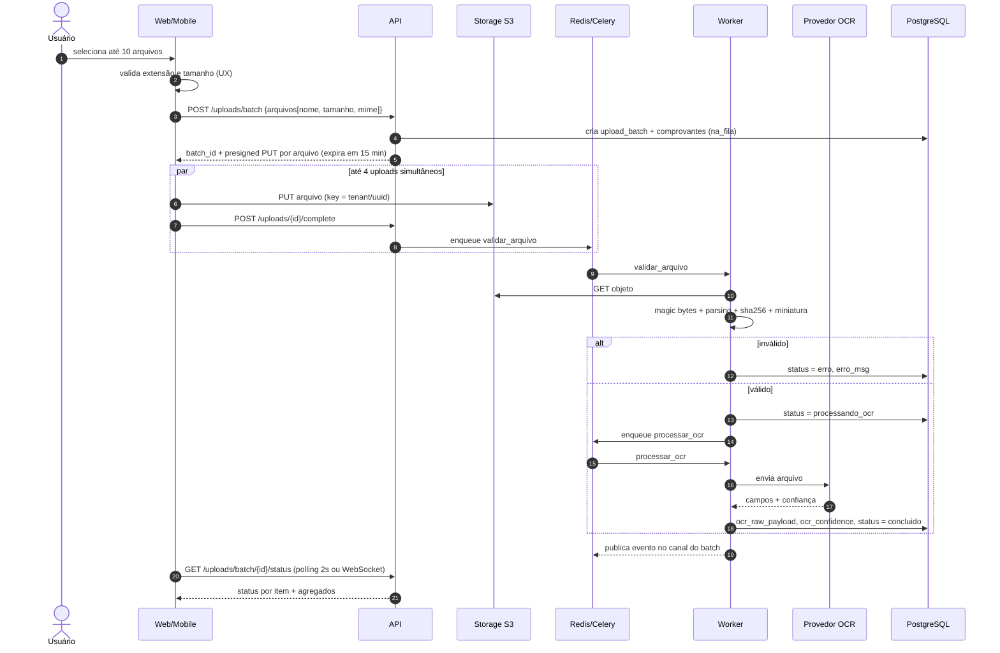
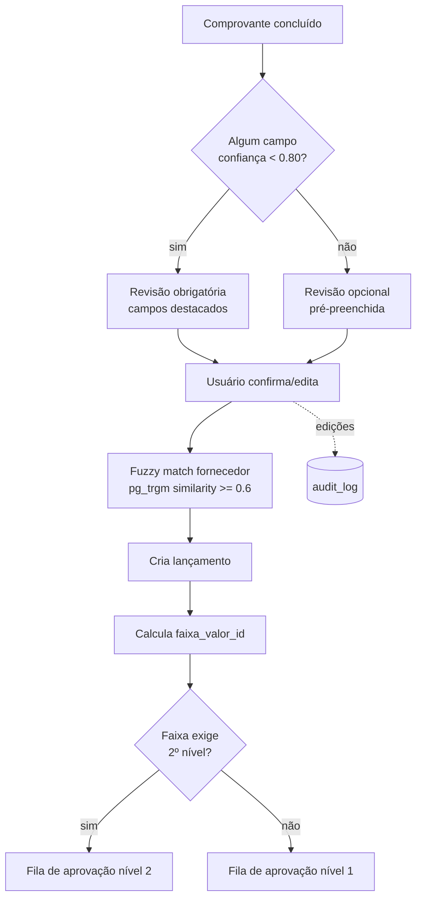
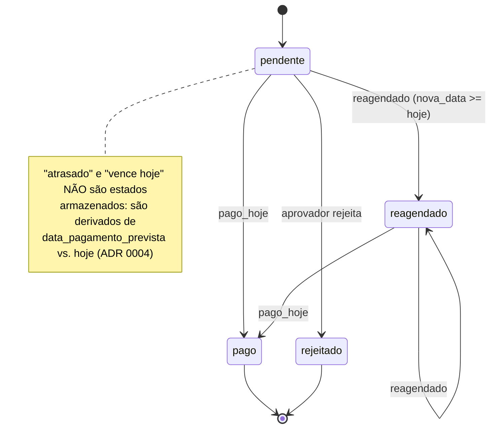
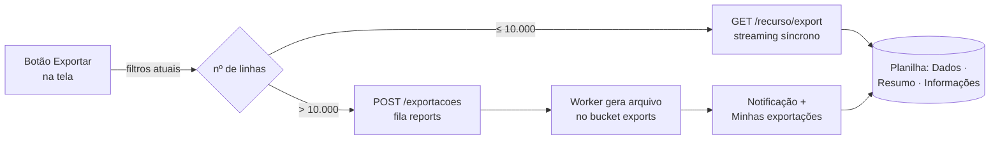

# Arquitetura

[← README](../README.md)

## 1. Visão de componentes

| Componente | Responsabilidade | Escala |
|------------|------------------|--------|
| **API (FastAPI)** | Autenticação, RBAC, CRUD, geração de presigned URLs, orquestração de jobs, relatórios síncronos pequenos | Stateless, horizontal |
| **Workers (Celery)** | Validação de arquivo, OCR, matching de fornecedor, geração de relatórios pesados, rotinas agendadas (retenção LGPD) | Horizontal, filas separadas |
| **PostgreSQL** | Fonte de verdade; isolamento por tenant via RLS | Vertical + réplica de leitura (pós-MVP) |
| **Redis** | Broker Celery, backend de resultados, cache de status de lote, pub/sub para WebSocket | Single node (MVP) |
| **Storage S3** | Comprovantes originais (imutáveis), miniaturas, relatórios exportados | Gerenciado |
| **Provedor OCR** | Extração de campos com score de confiança | Externo, atrás de adapter |
| **Web** | SPA para colaborador, aprovador e admin | CDN |
| **Mobile** | Captura por scanner e upload em lote | Lojas |

### Filas Celery

| Fila | Tasks | Concorrência sugerida |
|------|-------|----------------------|
| `validation` | `validar_arquivo` (magic bytes + parsing + sha256 + miniatura) | alta (CPU leve) |
| `ocr` | `processar_ocr` (chamada ao provedor, com retry exponencial) | limitada por rate limit do provedor |
| `reports` | `gerar_relatorio_pdf`, `exportar` (relatórios XLSX e listagens > 10.000 linhas) | baixa (CPU/memória pesada) |
| `maintenance` | `aplicar_retencao`, `recalcular_status` (beat) | 1 |

## 2. Camadas do backend

```
api/        → routers: parsing HTTP, dependências (auth, tenant, paginação)
schemas/    → contratos Pydantic de entrada/saída
services/   → casos de uso (UploadService, PagamentoService, AprovacaoService…)
domain/     → regras puras, sem I/O (calcular_faixa, status_efetivo, pode_aprovar)
models/     → SQLAlchemy ORM
db/         → engine, sessão, `tenant_context()` que emite SET LOCAL
workers/    → tasks Celery que chamam services
```

Regra: `domain/` não importa nada de `db/` nem de `api/` → 100% testável em unidade.

## 3. Multitenancy

Defesa em profundidade com duas barreiras independentes:

1. **Aplicação** — todo repositório recebe `tenant_id` do token e filtra explicitamente.
2. **Banco** — RLS com `FORCE ROW LEVEL SECURITY`; a aplicação conecta como `app_user` (não owner), e cada transação executa:

```sql
SET LOCAL app.current_tenant = '<uuid do token>';
```

Implementação: dependência FastAPI `get_tenant_session()` abre a transação, emite o `SET LOCAL` e entrega a sessão. Workers Celery recebem `tenant_id` no payload da task e usam o mesmo `tenant_context()`.

Ver [ADR 0002](adr/0002-multitenancy-com-rls.md).

## 4. Fluxo de upload em lote + OCR



Pontos técnicos:

- O arquivo **nunca passa pela API** — reduz carga e latência.
- A key no storage é `{tenant_id}/{yyyy}/{mm}/{uuid}.{ext}`; o nome original fica só no banco.
- O bucket tem **Object Lock / versionamento** (imutabilidade — RNF02).
- `processar_ocr` usa `autoretry_for` com backoff exponencial (máx. 3 tentativas) e é independente por arquivo (RNF06).

## 5. Fluxo de revisão e criação de lançamento



## 6. Fluxo de pagamento de boleto



Toda transição que altera data gera linha em `pagamento_eventos` na mesma transação. O endpoint aceita `Idempotency-Key` para evitar pagamento duplicado por duplo clique ou retry de rede.

## 7. Exportação para planilha

Qualquer listagem de contas (lançamentos/boletos, fornecedores, pagamentos, aprovações, auditoria, dashboard) pode ser baixada em XLSX ou CSV — RF12.



O motor `services/export/tabular.py` recebe a mesma *query* usada pela listagem e uma definição de colunas tipadas (texto, moeda, data, número, link). Assim a planilha tem sempre os mesmos dados, filtros e permissões da tela, com valores numéricos e datas reais (somáveis e filtráveis no Excel).

## 8. Segurança

| Tema | Controle |
|------|----------|
| Upload | Allowlist de extensão → magic bytes → parsing real; UUID como nome; bucket sem execução; `Content-Disposition: attachment` |
| Autenticação | Access token 15 min, refresh 7 dias com rotação e detecção de reuso; senhas com Argon2id |
| Autorização | RBAC por dependência FastAPI (`require_role("aprovador")`) + RLS |
| Transporte | HTTPS obrigatório; CORS restrito às origens do frontend |
| Dados pessoais | Retenção configurável por tenant; anonimização em job agendado (LGPD) |
| Segredos | Variáveis de ambiente; nunca no repositório; `.env.example` sem valores reais |
| Exportação de planilhas | Mesma consulta e permissões da tela + RLS; escape de células iniciadas por `= + - @` (formula injection); registro no `audit_log`; rate limit |
| Rate limit | Por usuário em `/auth/*`, `/uploads/batch` e `/*/export` |

## 9. Ambientes

| Ambiente | Banco | Storage | OCR |
|----------|-------|---------|-----|
| `local` | Postgres em Docker | MinIO | Tesseract (adapter local) |
| `staging` | Postgres gerenciado | S3 (bucket staging) | Provedor pago em modo sandbox |
| `production` | Postgres gerenciado + backups PITR | S3 com Object Lock | Provedor pago |
