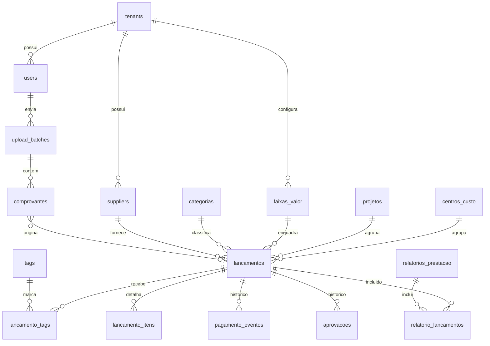

# Modelo de Dados

[← README](../README.md)

Schema PostgreSQL 16 refinado a partir da seção 6 do [plano original](../plano_completo_projeto_prestacao_contas.md). As tabelas são criadas incrementalmente via Alembic — a coluna **Sprint** indica quando cada uma entra.

## 1. Ajustes em relação ao plano original

| # | Problema no plano original | Ajuste | Sprint |
|---|----------------------------|--------|--------|
| 1 | Regra diz que status é **derivado**, mas a tabela armazena `atrasado` | Armazenar só estados explícitos (`pendente`, `reagendado`, `pago`, `rejeitado`); `atrasado`/`vence_hoje` calculados na view `v_lancamentos` ([ADR 0004](adr/0004-status-derivado-de-lancamento.md)) | 02 |
| 2 | "Auditoria completa de edições pós-OCR" sem tabela | Tabela `audit_log` append-only | 05 |
| 3 | RF02 extrai **itens**, sem onde guardar | Tabela `lancamento_itens` | 05 |
| 4 | RF05 cita **projeto/centro de custo**, sem tabelas | Tabelas `projetos` e `centros_custo` + FKs em `lancamentos` | 02 |
| 5 | Aprovação sem motivo de rejeição, nível ou histórico | Tabela `aprovacoes` append-only + `nivel_aprovacao_exigido` | 08 |
| 6 | `relatorio_lancamentos` sem `tenant_id` → RLS impossível | Adicionar `tenant_id` | 09 |
| 7 | `users.email UNIQUE` global impede o mesmo e-mail em dois tenants | `UNIQUE (tenant_id, email)`; login recebe e-mail + slug do tenant | 01 |
| 8 | Sem campos de credencial | `password_hash`, `ativo`, `ultimo_login_em` + tabela `refresh_tokens` | 01 |
| 9 | Comprovante sem hash nem controle de retry | `sha256`, `tamanho_bytes`, `nome_original`, `tentativas_ocr`, `erro_msg`, `thumbnail_key` | 03/04 |
| 10 | Faixas de valor podem se sobrepor | `EXCLUDE USING gist` sobre `numrange` + `exige_segundo_nivel` + `ordem` | 06 |
| 11 | `storage_url` guarda URL (expira/muda) | Guardar `storage_key`; URL é gerada sob demanda | 03 |
| 12 | Sem `updated_at` nem soft delete | `updated_at` via trigger; `deleted_at` em entidades cadastrais | 02 |
| 13 | `tipo_evento` só cobre pagamento | Incluir `estornado` para desfazer pagamento com rastro | 07 |
| 14 | Sem política de retenção | `tenants.retencao_meses` (mín. 60) + `anonimizado_em` / `removido_em` | 11 |
| 15 | `status_processamento` sem etapa de validação | Adicionar `validando` e `aguardando_revisao` | 03/05 |
| 16 | Relatório fechado mudaria se um lançamento fosse editado | `relatorios_prestacao.snapshot` JSONB congelado no fechamento | 09 |
| 17 | Fuzzy matching repetiria a mesma sugestão sempre | Tabela `supplier_aliases` memoriza confirmações | 05 |
| 18 | Exportação prevista só para relatórios de prestação de contas | RF12: exportação de qualquer listagem para planilha; `relatorio_exportacoes` generalizada em `exportacoes`; ação `exportar` no `audit_log` | 07/09 |
| 19 | Categoria única não expressa características que se somam (conta recorrente **e** de concessionária) | RF13: tabela `tags` por empresa + `lancamento_tags` (N:N), com tags padrão por tipo de conta; a categoria continua única | extra (0005) |

## 2. Diagrama ER (resumo)



## 3. DDL de referência

```sql
-- Extensões (infra/postgres/init)
CREATE EXTENSION IF NOT EXISTS pgcrypto;     -- gen_random_uuid()
CREATE EXTENSION IF NOT EXISTS pg_trgm;      -- fuzzy match de fornecedor
CREATE EXTENSION IF NOT EXISTS btree_gist;   -- exclusão de faixas sobrepostas
CREATE EXTENSION IF NOT EXISTS unaccent;     -- normalização de nomes de fornecedor

-- ========== Sprint 01 ==========
CREATE TABLE tenants (
    id              UUID PRIMARY KEY DEFAULT gen_random_uuid(),
    nome            VARCHAR(255) NOT NULL,
    slug            VARCHAR(63)  NOT NULL UNIQUE,
    retencao_meses  INT NOT NULL DEFAULT 60 CHECK (retencao_meses >= 60),  -- mín. 5 anos (fiscal)
    limiar_confianca NUMERIC(3,2) NOT NULL DEFAULT 0.80,                -- Sprint 05
    ativo           BOOLEAN NOT NULL DEFAULT true,
    created_at      TIMESTAMPTZ NOT NULL DEFAULT now(),
    updated_at      TIMESTAMPTZ NOT NULL DEFAULT now()
);

CREATE TABLE users (
    id               UUID PRIMARY KEY DEFAULT gen_random_uuid(),
    tenant_id        UUID NOT NULL REFERENCES tenants(id),
    nome             VARCHAR(255) NOT NULL,
    email            VARCHAR(255) NOT NULL,
    password_hash    TEXT NOT NULL,
    role             VARCHAR(20) NOT NULL CHECK (role IN ('admin','aprovador','colaborador')),
    nivel_aprovacao  SMALLINT NOT NULL DEFAULT 0 CHECK (nivel_aprovacao BETWEEN 0 AND 2),
    ativo            BOOLEAN NOT NULL DEFAULT true,
    ultimo_login_em  TIMESTAMPTZ,
    lembretes_ativos BOOLEAN NOT NULL DEFAULT true,     -- Sprint 07
    anonimizado_em   TIMESTAMPTZ,                       -- Sprint 11
    created_at       TIMESTAMPTZ NOT NULL DEFAULT now(),
    updated_at       TIMESTAMPTZ NOT NULL DEFAULT now(),
    UNIQUE (tenant_id, email)
);

CREATE TABLE refresh_tokens (
    id           UUID PRIMARY KEY DEFAULT gen_random_uuid(),
    tenant_id    UUID NOT NULL REFERENCES tenants(id),
    user_id      UUID NOT NULL REFERENCES users(id),
    token_hash   TEXT NOT NULL UNIQUE,          -- sha256 do token, nunca o token puro
    family_id    UUID NOT NULL,                 -- detecção de reuso (rotação)
    expires_at   TIMESTAMPTZ NOT NULL,
    revoked_at   TIMESTAMPTZ,
    created_at   TIMESTAMPTZ NOT NULL DEFAULT now()
);

-- ========== Sprint 02 ==========
CREATE TABLE suppliers (
    id             UUID PRIMARY KEY DEFAULT gen_random_uuid(),
    tenant_id      UUID NOT NULL REFERENCES tenants(id),
    nome_fantasia  VARCHAR(255) NOT NULL,
    razao_social   VARCHAR(255),
    cnpj           CHAR(14),                    -- somente dígitos; formatação na UI
    created_at     TIMESTAMPTZ NOT NULL DEFAULT now(),
    updated_at     TIMESTAMPTZ NOT NULL DEFAULT now(),
    deleted_at     TIMESTAMPTZ
);
CREATE UNIQUE INDEX uq_suppliers_cnpj ON suppliers (tenant_id, cnpj)
    WHERE cnpj IS NOT NULL AND deleted_at IS NULL;
CREATE INDEX ix_suppliers_nome_trgm ON suppliers USING gin (nome_fantasia gin_trgm_ops);

CREATE TABLE categorias (
    id          UUID PRIMARY KEY DEFAULT gen_random_uuid(),
    tenant_id   UUID NOT NULL REFERENCES tenants(id),
    nome        VARCHAR(100) NOT NULL,
    deleted_at  TIMESTAMPTZ,
    UNIQUE (tenant_id, nome)
);

CREATE TABLE projetos (
    id          UUID PRIMARY KEY DEFAULT gen_random_uuid(),
    tenant_id   UUID NOT NULL REFERENCES tenants(id),
    nome        VARCHAR(150) NOT NULL,
    ativo       BOOLEAN NOT NULL DEFAULT true,
    UNIQUE (tenant_id, nome)
);

CREATE TABLE centros_custo (
    id          UUID PRIMARY KEY DEFAULT gen_random_uuid(),
    tenant_id   UUID NOT NULL REFERENCES tenants(id),
    codigo      VARCHAR(30)  NOT NULL,
    nome        VARCHAR(150) NOT NULL,
    ativo       BOOLEAN NOT NULL DEFAULT true,
    UNIQUE (tenant_id, codigo)
);

CREATE TABLE lancamentos (
    id                        UUID PRIMARY KEY DEFAULT gen_random_uuid(),
    tenant_id                 UUID NOT NULL REFERENCES tenants(id),
    usuario_id                UUID NOT NULL REFERENCES users(id),
    supplier_id               UUID REFERENCES suppliers(id),
    categoria_id              UUID REFERENCES categorias(id),
    projeto_id                UUID REFERENCES projetos(id),
    centro_custo_id           UUID REFERENCES centros_custo(id),
    faixa_valor_id            UUID,             -- FK adicionada na Sprint 06
    descricao                 VARCHAR(500),
    valor                     NUMERIC(12,2) NOT NULL CHECK (valor > 0),
    forma_pagamento           VARCHAR(20)
        CHECK (forma_pagamento IN ('boleto','pix','cartao','dinheiro','transferencia','outro')),
    linha_digitavel           VARCHAR(60),
    data_emissao              DATE NOT NULL,
    data_pagamento_prevista   DATE,
    data_pagamento_efetiva    DATE,
    status                    VARCHAR(20) NOT NULL DEFAULT 'pendente'
        CHECK (status IN ('pendente','reagendado','pago','rejeitado')),
    status_aprovacao          VARCHAR(20) NOT NULL DEFAULT 'rascunho'
        CHECK (status_aprovacao IN ('rascunho','aguardando','aprovado','rejeitado')),
    nivel_aprovacao_exigido   SMALLINT NOT NULL DEFAULT 1,
    aprovado_por              UUID REFERENCES users(id),
    aprovado_em               TIMESTAMPTZ,
    version                   INT NOT NULL DEFAULT 1,   -- optimistic locking
    anonimizado_em            TIMESTAMPTZ,              -- Sprint 11 (retenção LGPD)
    created_at                TIMESTAMPTZ NOT NULL DEFAULT now(),
    updated_at                TIMESTAMPTZ NOT NULL DEFAULT now(),
    deleted_at                TIMESTAMPTZ,
    CHECK (status <> 'pago' OR data_pagamento_efetiva IS NOT NULL)
);
CREATE INDEX ix_lanc_vencimento ON lancamentos (tenant_id, data_pagamento_prevista)
    WHERE deleted_at IS NULL;
CREATE INDEX ix_lanc_supplier   ON lancamentos (tenant_id, supplier_id);
CREATE INDEX ix_lanc_aprovacao  ON lancamentos (tenant_id, status_aprovacao, nivel_aprovacao_exigido);

-- "Hoje" no fuso do negócio, independente do fuso do servidor
CREATE FUNCTION hoje_negocio() RETURNS date LANGUAGE sql STABLE AS $$
    SELECT (now() AT TIME ZONE 'America/Sao_Paulo')::date
$$;

-- Status efetivo derivado (ADR 0004)
CREATE VIEW v_lancamentos WITH (security_invoker = true) AS
SELECT l.*,
       CASE
         WHEN l.status IN ('pago','rejeitado')            THEN l.status
         WHEN l.data_pagamento_prevista < hoje_negocio()  THEN 'atrasado'
         WHEN l.data_pagamento_prevista = hoje_negocio()  THEN 'vence_hoje'
         ELSE l.status
       END AS status_efetivo,
       (l.data_pagamento_prevista - hoje_negocio()) AS dias_para_vencimento
FROM lancamentos l
WHERE l.deleted_at IS NULL;

-- ========== Sprint 03 ==========
-- Os agregados do lote (concluídos, com erro) são derivados dos comprovantes e servidos
-- de um cache Redis (hash batch:{id}) atualizado por quem muda cada item — sem contador
-- na tabela para manter em sincronia.
CREATE TABLE upload_batches (
    id              UUID PRIMARY KEY DEFAULT gen_random_uuid(),
    tenant_id       UUID NOT NULL REFERENCES tenants(id) ON DELETE CASCADE,
    usuario_id      UUID NOT NULL REFERENCES users(id),
    total_arquivos  INT NOT NULL CHECK (total_arquivos BETWEEN 1 AND 10),
    tamanho_total   BIGINT NOT NULL CHECK (tamanho_total BETWEEN 1 AND 62914560),  -- 60 MB
    origem          VARCHAR(10) NOT NULL DEFAULT 'web' CHECK (origem IN ('web','mobile')),
    created_at      TIMESTAMPTZ NOT NULL DEFAULT now()
);
CREATE INDEX ix_batches_usuario ON upload_batches (tenant_id, usuario_id);

CREATE TABLE comprovantes (
    id                    UUID PRIMARY KEY DEFAULT gen_random_uuid(),
    tenant_id             UUID NOT NULL REFERENCES tenants(id) ON DELETE CASCADE,
    usuario_id            UUID NOT NULL REFERENCES users(id),  -- quem enviou
    upload_batch_id       UUID REFERENCES upload_batches(id),
    lancamento_id         UUID REFERENCES lancamentos(id),
    storage_key           TEXT NOT NULL UNIQUE,  -- {tenant}/{aaaa}/{mm}/{id}.{ext}; quarentena/… se recusado
    thumbnail_key         TEXT,                  -- thumbnails/…webp (sem EXIF)
    nome_original         VARCHAR(255) NOT NULL,
    mime_type             VARCHAR(50)  NOT NULL  -- detectado pelos magic bytes, não pelo cliente
        CHECK (mime_type IN ('application/pdf','image/jpeg','image/png')),
    extensao_original     VARCHAR(10)  NOT NULL,
    tamanho_bytes         BIGINT NOT NULL CHECK (tamanho_bytes BETWEEN 1 AND 10485760),  -- 10 MB
    sha256                CHAR(64),
    possivel_duplicado    BOOLEAN NOT NULL DEFAULT false,  -- mesmo sha256 no tenant (não bloqueia)
    total_paginas         INT NOT NULL DEFAULT 1 CHECK (total_paginas >= 1),
    -- "na fila" é estado do navegador (antes do PUT); no banco o item nasce "enviando".
    status_processamento  VARCHAR(20) NOT NULL DEFAULT 'enviando'
        CHECK (status_processamento IN
        ('enviando','validando','processando_ocr','aguardando_revisao','concluido','erro')),
    erro_msg              TEXT,
    imutavel              BOOLEAN NOT NULL DEFAULT false,  -- Object Lock aplicado ao original
    tentativas_ocr        SMALLINT NOT NULL DEFAULT 0,
    ocr_provider          VARCHAR(30),
    ocr_raw_payload       JSONB,
    ocr_confidence        JSONB,          -- {"valor":0.97,"cnpj":0.62,...}
    -- removido_em        TIMESTAMPTZ     -- Sprint 11: arquivo apagado por retenção
    created_at            TIMESTAMPTZ NOT NULL DEFAULT now(),
    updated_at            TIMESTAMPTZ NOT NULL DEFAULT now()
);
CREATE INDEX ix_comp_batch  ON comprovantes (upload_batch_id);
CREATE INDEX ix_comp_sha    ON comprovantes (tenant_id, sha256);   -- detecção de duplicidade
CREATE INDEX ix_comp_status ON comprovantes (status_processamento, created_at);  -- rotina de abandonados

-- Rotinas de manutenção percorrem as empresas e processam cada uma com o próprio
-- tenant (SET LOCAL) — nunca com uma role que ignore o RLS.
CREATE FUNCTION listar_tenants_ativos() RETURNS SETOF uuid
    LANGUAGE sql STABLE SECURITY DEFINER SET search_path = public, pg_temp
    AS $$ SELECT id FROM tenants WHERE ativo ORDER BY created_at $$;

-- ========== Tags por tipo de conta (RF13, fora do plano original; migração 0005) ==========
-- Várias por lançamento (ex.: Recorrente + Concessionárias). A categoria continua única.
-- Tags padrão de cada empresa: Recorrente, Aquisição, Serviços prestados, Concessionárias,
-- Manutenção geral, Despesas administrativas, Materiais para manutenção, Folha de pagamento.
CREATE TABLE tags (
    id          UUID PRIMARY KEY DEFAULT gen_random_uuid(),
    tenant_id   UUID NOT NULL REFERENCES tenants(id) ON DELETE CASCADE,
    nome        VARCHAR(50) NOT NULL,
    ativo       BOOLEAN NOT NULL DEFAULT true,   -- desativada: some dos formulários, fica nos lançamentos
    created_at  TIMESTAMPTZ NOT NULL DEFAULT now(),
    updated_at  TIMESTAMPTZ NOT NULL DEFAULT now()
);
CREATE UNIQUE INDEX uq_tags_nome ON tags (tenant_id, lower(nome));  -- "recorrente" = "Recorrente"

-- tenant_id vem da sessão (o ORM grava só o par); o RLS confere o WITH CHECK.
CREATE TABLE lancamento_tags (
    tenant_id      UUID NOT NULL DEFAULT app_current_tenant() REFERENCES tenants(id) ON DELETE CASCADE,
    lancamento_id  UUID NOT NULL REFERENCES lancamentos(id) ON DELETE CASCADE,
    tag_id         UUID NOT NULL REFERENCES tags(id) ON DELETE CASCADE,
    PRIMARY KEY (lancamento_id, tag_id)
);
CREATE INDEX ix_lancamento_tags_tag ON lancamento_tags (tenant_id, tag_id);  -- filtro por tag

-- ========== Sprint 05 ==========
CREATE TABLE lancamento_itens (
    id              UUID PRIMARY KEY DEFAULT gen_random_uuid(),
    tenant_id       UUID NOT NULL REFERENCES tenants(id),
    lancamento_id   UUID NOT NULL REFERENCES lancamentos(id) ON DELETE CASCADE,
    descricao       VARCHAR(255) NOT NULL,
    quantidade      NUMERIC(12,3) NOT NULL DEFAULT 1,
    valor_unitario  NUMERIC(12,2),
    valor_total     NUMERIC(12,2) NOT NULL
);

CREATE TABLE audit_log (
    id            BIGINT GENERATED ALWAYS AS IDENTITY PRIMARY KEY,
    tenant_id     UUID NOT NULL REFERENCES tenants(id),
    usuario_id    UUID REFERENCES users(id),           -- NULL = sistema/worker
    entidade      VARCHAR(50) NOT NULL,                -- 'lancamento', 'supplier'...
    entidade_id   UUID NOT NULL,
    acao          VARCHAR(20) NOT NULL CHECK (acao IN ('criar','editar','excluir','ocr_corrigido','exportar')),  -- 'exportar' a partir da Sprint 07
    campo         VARCHAR(50),
    valor_antigo  JSONB,
    valor_novo    JSONB,
    created_at    TIMESTAMPTZ NOT NULL DEFAULT now()
);
CREATE INDEX ix_audit_entidade ON audit_log (tenant_id, entidade, entidade_id);

-- Memória de matching: texto lido pelo OCR -> fornecedor confirmado pelo usuário
CREATE TABLE supplier_aliases (
    id                 UUID PRIMARY KEY DEFAULT gen_random_uuid(),
    tenant_id          UUID NOT NULL REFERENCES tenants(id),
    texto_normalizado  VARCHAR(255) NOT NULL,
    supplier_id        UUID NOT NULL REFERENCES suppliers(id),
    created_at         TIMESTAMPTZ NOT NULL DEFAULT now(),
    UNIQUE (tenant_id, texto_normalizado)
);

-- ========== Sprint 06 ==========
CREATE TABLE faixas_valor (
    id                    UUID PRIMARY KEY DEFAULT gen_random_uuid(),
    tenant_id             UUID NOT NULL REFERENCES tenants(id),
    nome                  VARCHAR(50) NOT NULL,
    valor_min             NUMERIC(12,2) NOT NULL CHECK (valor_min >= 0),
    valor_max             NUMERIC(12,2),                -- NULL = sem teto
    cor                   CHAR(7),                      -- #RRGGBB para badges
    ordem                 SMALLINT NOT NULL,
    exige_segundo_nivel   BOOLEAN NOT NULL DEFAULT false,
    CHECK (valor_max IS NULL OR valor_max > valor_min),
    EXCLUDE USING gist (
        tenant_id WITH =,
        numrange(valor_min, valor_max, '[)') WITH &&
    )
);
ALTER TABLE lancamentos
    ADD CONSTRAINT fk_lanc_faixa FOREIGN KEY (faixa_valor_id) REFERENCES faixas_valor(id);

-- ========== Sprint 07 ==========
CREATE TABLE pagamento_eventos (
    id               UUID PRIMARY KEY DEFAULT gen_random_uuid(),
    tenant_id        UUID NOT NULL REFERENCES tenants(id),
    lancamento_id    UUID NOT NULL REFERENCES lancamentos(id),
    usuario_id       UUID NOT NULL REFERENCES users(id),
    tipo_evento      VARCHAR(20) NOT NULL
        CHECK (tipo_evento IN ('pago_hoje','reagendado','pago_atrasado','estornado')),
    data_anterior    DATE,
    data_nova        DATE,
    observacao       VARCHAR(500),
    idempotency_key  VARCHAR(64),
    created_at       TIMESTAMPTZ NOT NULL DEFAULT now(),
    UNIQUE (tenant_id, idempotency_key)
);
-- Append-only: bloquear UPDATE/DELETE para app_user
REVOKE UPDATE, DELETE ON pagamento_eventos FROM app_user;

-- ========== Sprint 08 ==========
CREATE TABLE aprovacoes (
    id              UUID PRIMARY KEY DEFAULT gen_random_uuid(),
    tenant_id       UUID NOT NULL REFERENCES tenants(id),
    lancamento_id   UUID NOT NULL REFERENCES lancamentos(id),
    aprovador_id    UUID NOT NULL REFERENCES users(id),
    nivel           SMALLINT NOT NULL CHECK (nivel IN (1,2)),
    decisao         VARCHAR(10) NOT NULL CHECK (decisao IN ('aprovado','rejeitado')),
    justificativa   VARCHAR(1000),
    created_at      TIMESTAMPTZ NOT NULL DEFAULT now(),
    CHECK (decisao = 'aprovado' OR length(trim(justificativa)) >= 10)
);
REVOKE UPDATE, DELETE ON aprovacoes, audit_log FROM app_user;

-- ========== Sprint 09 ==========
CREATE TABLE relatorios_prestacao (
    id                UUID PRIMARY KEY DEFAULT gen_random_uuid(),
    tenant_id         UUID NOT NULL REFERENCES tenants(id),
    usuario_id        UUID NOT NULL REFERENCES users(id),
    titulo            VARCHAR(255) NOT NULL,
    periodo_inicio    DATE NOT NULL,
    periodo_fim       DATE NOT NULL,
    projeto_id        UUID REFERENCES projetos(id),
    centro_custo_id   UUID REFERENCES centros_custo(id),
    total             NUMERIC(14,2) NOT NULL DEFAULT 0,
    status            VARCHAR(20) NOT NULL DEFAULT 'aberto'
        CHECK (status IN ('aberto','fechado')),
    fechado_em        TIMESTAMPTZ,
    snapshot          JSONB,              -- congelado no fechamento
    created_at        TIMESTAMPTZ NOT NULL DEFAULT now(),
    CHECK (periodo_fim >= periodo_inicio)
);

CREATE TABLE relatorio_lancamentos (
    tenant_id      UUID NOT NULL REFERENCES tenants(id),
    relatorio_id   UUID NOT NULL REFERENCES relatorios_prestacao(id) ON DELETE CASCADE,
    lancamento_id  UUID NOT NULL REFERENCES lancamentos(id),
    PRIMARY KEY (relatorio_id, lancamento_id)
);

-- Exportações assíncronas: relatórios (PDF/XLSX) e listagens grandes (> 10.000 linhas).
-- Exportações pequenas (Sprint 07) são síncronas em streaming e ficam registradas só no audit_log.
CREATE TABLE exportacoes (
    id             UUID PRIMARY KEY DEFAULT gen_random_uuid(),
    tenant_id      UUID NOT NULL REFERENCES tenants(id),
    usuario_id     UUID NOT NULL REFERENCES users(id),
    tipo           VARCHAR(30) NOT NULL
        CHECK (tipo IN ('relatorio_pdf','relatorio_xlsx','lancamentos','fornecedores',
                        'pagamentos','aprovacoes','auditoria','dashboard')),
    formato        VARCHAR(5) NOT NULL CHECK (formato IN ('pdf','xlsx','csv')),
    relatorio_id   UUID REFERENCES relatorios_prestacao(id),
    filtros        JSONB NOT NULL DEFAULT '{}',   -- mesmos filtros da listagem na tela
    colunas        TEXT[],                        -- NULL = conjunto padrão
    status         VARCHAR(15) NOT NULL DEFAULT 'na_fila'
        CHECK (status IN ('na_fila','gerando','pronto','erro')),
    total_linhas   INT,
    storage_key    TEXT,
    erro_msg       TEXT,
    created_at     TIMESTAMPTZ NOT NULL DEFAULT now(),
    concluido_em   TIMESTAMPTZ,
    CHECK ((tipo LIKE 'relatorio_%') = (relatorio_id IS NOT NULL))
);
-- ========== Sprint 10 ==========
CREATE TABLE dispositivos (
    id           UUID PRIMARY KEY DEFAULT gen_random_uuid(),
    tenant_id    UUID NOT NULL REFERENCES tenants(id),
    user_id      UUID NOT NULL REFERENCES users(id),
    push_token   TEXT NOT NULL,
    plataforma   VARCHAR(10) NOT NULL CHECK (plataforma IN ('android','ios')),
    ativo        BOOLEAN NOT NULL DEFAULT true,
    created_at   TIMESTAMPTZ NOT NULL DEFAULT now(),
    UNIQUE (tenant_id, push_token)
);
```

## 4. Row Level Security

Aplicado a **todas** as tabelas com `tenant_id`, via função auxiliar numa migração:

```sql
CREATE ROLE app_user NOLOGIN;
CREATE ROLE app_api LOGIN PASSWORD '...' IN ROLE app_user;   -- usado pela API e workers
-- O owner das tabelas é 'app_owner' (usado somente pelo Alembic)

CREATE OR REPLACE FUNCTION app_current_tenant() RETURNS uuid
LANGUAGE sql STABLE AS $$
    SELECT nullif(current_setting('app.current_tenant', true), '')::uuid
$$;

-- Para cada tabela T com tenant_id:
ALTER TABLE T ENABLE ROW LEVEL SECURITY;
ALTER TABLE T FORCE  ROW LEVEL SECURITY;
CREATE POLICY tenant_isolation ON T
    USING      (tenant_id = app_current_tenant())
    WITH CHECK (tenant_id = app_current_tenant());
```

Exceções controladas:

- **`tenants`**: policy `id = app_current_tenant()`.
- **Login** precisa localizar o usuário antes de conhecer o tenant → o login recebe o `slug`, resolve o `tenant_id` por uma função `SECURITY DEFINER` `resolve_tenant(slug)` e só então abre a transação com `SET LOCAL`.
- **Jobs de manutenção** (retenção LGPD) iteram tenants e executam `SET LOCAL` por tenant — nunca usam role com `BYPASSRLS`.

Teste obrigatório (Sprint 01): com `app.current_tenant = A`, `SELECT count(*)` em cada tabela retorna apenas linhas de A; sem `SET LOCAL`, retorna **zero** linhas; `INSERT` com `tenant_id = B` falha.

## 5. Convenções

- PK UUID v4 (`gen_random_uuid()`); `audit_log` usa `BIGINT IDENTITY` por volume.
- Valores monetários em `NUMERIC(12,2)` — nunca `float`. No Python, `Decimal`.
- Datas de negócio em `DATE`; eventos em `TIMESTAMPTZ` (UTC). Fuso de referência para "hoje": `America/Sao_Paulo`, configurável por tenant pós-MVP.
- CNPJ armazenado só com dígitos, validado por dígito verificador na camada `domain/`.
- Trigger genérica `set_updated_at()` em todas as tabelas com `updated_at`.
