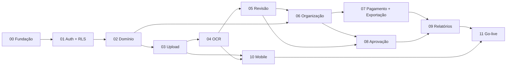

# Sprints

[← README](../../README.md)

- **Cadência:** 2 semanas (10 dias úteis)
- **Time:** 1 desenvolvedor full-stack
- **Capacidade:** ~20 pontos por sprint (1 ponto ≈ meio dia) — ver [convenções](../convencoes.md#6-estimativa)
- **Duração total:** 12 sprints ≈ 24 semanas

## Calendário

Datas de referência, considerando início em 05/10/2026. Ajuste conforme a data real de início.

| Sprint | Período | Tema | Pontos | Marco |
|--------|---------|------|--------|-------|
| [00](sprint-00.md) | 05/10 – 16/10/2026 | Fundação do projeto | 19 | |
| [01](sprint-01.md) | 19/10 – 30/10/2026 | Autenticação e multitenancy | 21 | |
| [02](sprint-02.md) | 02/11 – 13/11/2026 | Núcleo de domínio | 20 | **M1 — Núcleo** (fase 1 do roadmap) |
| [03](sprint-03.md) | 16/11 – 27/11/2026 | Upload em lote | 21 | |
| [04](sprint-04.md) | 30/11 – 11/12/2026 | Pipeline de OCR assíncrono | 21 | |
| [05](sprint-05.md) | 14/12 – 08/01/2027 | Revisão do OCR | 20 | **M2 — Upload e OCR** (fase 2) · sprint estendida por festas |
| [06](sprint-06.md) | 11/01 – 22/01/2027 | Organização automática e dashboard | 21 | **M3 — Organização** (fase 3) |
| [07](sprint-07.md) | 25/01 – 05/02/2027 | Pagamento de boletos e exportação para planilha | 21 | |
| [08](sprint-08.md) | 08/02 – 19/02/2027 | Aprovação multinível e auditoria | 20 | |
| [09](sprint-09.md) | 22/02 – 05/03/2027 | Relatórios de prestação de contas | 21 | **M4 — Pagamento e prestação de contas** (fase 4) · MVP web completo |
| [10](sprint-10.md) | 08/03 – 19/03/2027 | App mobile com scanner | 21 | |
| [11](sprint-11.md) | 22/03 – 02/04/2027 | Hardening e go-live | 20 | **M5 — Produção** |

## Dependências entre sprints

A Sprint 10 (mobile) depende só da API de upload/OCR; pode ser antecipada para logo após a Sprint 05 se o scanner for prioridade de negócio.

## Matriz de rastreabilidade

### Requisitos funcionais

| Requisito | Descrição | Sprints |
|-----------|-----------|---------|
| RF01 | Captura via câmera ou upload, até 10 docs | 03 (web), 10 (mobile) |
| RF02 | Extração automática (fornecedor, CNPJ, datas, valor, forma de pgto, itens) | 04, 05 |
| RF03 | Classificação por faixa de valor + ordenação por vencimento | 06 |
| RF04 | Edição manual dos campos extraídos | 05 |
| RF05 | Vínculo a relatórios por período/projeto/centro de custo | 02 (cadastros), 09 |
| RF06 | Fluxo de aprovação colaborador → aprovador | 08 |
| RF07 | Exportação PDF/Excel com comprovantes | 09 |
| RF08 | Dashboard por fornecedor, faixa e status | 06 |
| RF09 | Pagamento de boleto: pago hoje / reagendar | 07 |
| RF10 | Multiempresa com isolamento por tenant | 01 |
| RF11 | Upload de PDF multi-página e JPG/PNG | 03, 04 |
| RF12 | Exportação das tabelas do sistema para planilha (XLSX/CSV) | 07 (motor + listas), 08 (auditoria, aprovações), 09 (assíncrona > 10.000 linhas) |

### Requisitos não funcionais

| Requisito | Descrição | Sprints |
|-----------|-----------|---------|
| RNF01 | Upload e OCR assíncronos, progresso item a item | 03, 04 |
| RNF02 | Armazenamento imutável do original | 03 |
| RNF03 | Isolamento via RLS | 01 (+ suíte em todas) |
| RNF04 | Retenção configurável (LGPD) | 11 |
| RNF05 | Medição de acurácia do OCR com dados reais | 04 (dataset), 11 (benchmark) |
| RNF06 | Retry automático por arquivo | 04 |
| RNF07 | Validação de upload em 3 camadas | 03 |
| RNF08 | Limite 10 MB/arquivo e 60 MB/lote | 03 |

### Telas (wireframes)

| Tela | Nome | Sprint |
|------|------|--------|
| 1 | Upload em lote | 03 |
| 2 | Loading/processamento | 04 |
| 3 | Revisão do OCR | 05 |
| 4 | Lista de documentos/boletos | 02 (versão simples), 06 (completa) |
| 5 | Modal de pagamento | 07 |
| 6 | Relatório de prestação de contas | 09 |
| 7 | Dashboard | 06 |
| 8 | Aprovação (gestor) | 08 |

## Template de sprint

Todo arquivo de sprint segue a estrutura:

1. **Objetivo** — sprint goal em uma frase
2. **Requisitos cobertos**
3. **Histórias de usuário** — com critérios de aceite (Dado / Quando / Então) e pontos
4. **Tarefas técnicas** — por camada (Dados, Backend, Frontend, Infra)
5. **Contrato de API** — endpoints novos
6. **Estratégia de testes**
7. **Definition of Done específica** (soma-se à [DoD global](../convencoes.md#5-definition-of-done-global))
8. **Riscos e mitigação**
9. **Entregável / demo**
10. **Retrospectiva** — preenchida ao final
